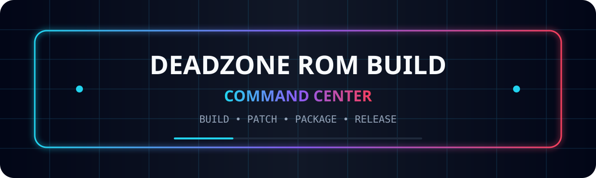
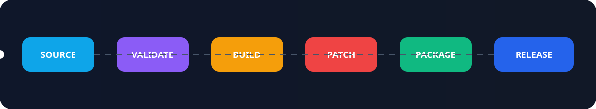
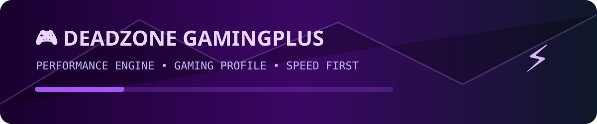
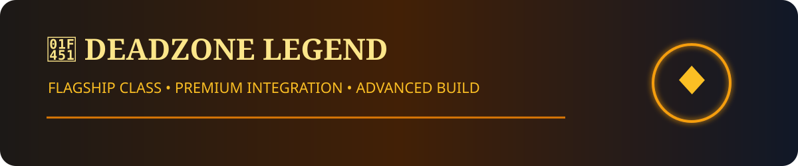
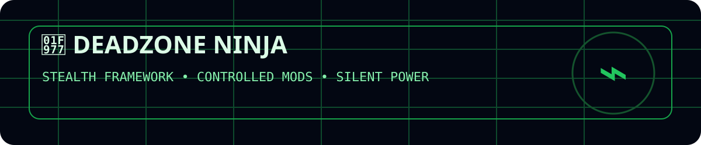
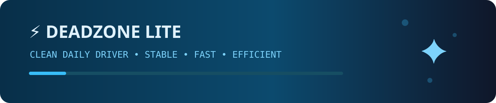
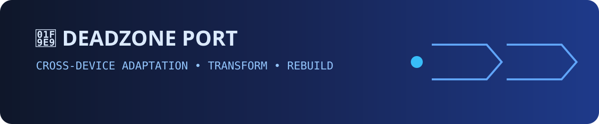
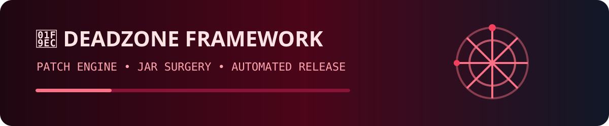

<p align="center">
  
</p>

<p align="center">
  <a href="https://github.com/DeadZone-Offical/DeadZone_GamingPlus"></a>
  <a href="https://github.com/DeadZone-Offical/DeadZone_Legend"></a>
  <a href="https://github.com/DeadZone-Offical/DeadZone_Ninja"></a>
</p>
<p align="center">
  <a href="https://github.com/DeadZone-Offical/DeadZone_Lite"></a>
  <a href="https://github.com/DeadZone-Offical/DeadZone_Port"></a>
  <a href="https://github.com/DeadZone-Offical/DeadZone-xiaomi_FrameworkPatcher"></a>
</p>

---

# 🚀 DeadZone ROM Build Network

**DeadZone Home** is the control center for the DeadZone ROM build ecosystem — a collection of specialized Android build tracks designed for different performance profiles, devices, and framework workflows.

<p align="center">
  
</p>

> **SOURCE → VALIDATE → BUILD → PATCH → PACKAGE → UPLOAD → RELEASE**

---

# 🎮 DeadZone GamingPlus

<p align="center">
  <a href="https://github.com/DeadZone-Offical/DeadZone_GamingPlus">
    
  </a>
</p>

**Performance-first ROM engineering.** GamingPlus is built around responsiveness, sustained performance, and a more aggressive tuning direction for users who want speed before subtlety.

<p align="center"><strong>⚡ PERFORMANCE • 🎯 RESPONSIVENESS • 🔥 GAMING PROFILE</strong></p>

---

# 👑 DeadZone Legend

<p align="center">
  <a href="https://github.com/DeadZone-Offical/DeadZone_Legend">
    
  </a>
</p>

**Flagship-focused build line.** Legend presents the premium DeadZone direction with a stronger emphasis on polish, advanced integration, and a heavyweight feature set.

<p align="center"><strong>👑 FLAGSHIP • ✨ PREMIUM • 🏆 ADVANCED</strong></p>

---

# 🥷 DeadZone Ninja

<p align="center">
  <a href="https://github.com/DeadZone-Offical/DeadZone_Ninja">
    
  </a>
</p>

**Stealth framework integration.** Ninja focuses on controlled, precise system modification with a darker, more tactical identity and framework-heavy workflows.

<p align="center"><strong>🥷 STEALTH • 🧠 FRAMEWORK • 🛡️ CONTROL</strong></p>

---

# ⚡ DeadZone Lite

<p align="center">
  <a href="https://github.com/DeadZone-Offical/DeadZone_Lite">
    
  </a>
</p>

**Clean daily-driver architecture.** Lite targets stability, efficiency, and a lean build path without sacrificing the DeadZone core experience.

<p align="center"><strong>⚡ FAST • 🧼 CLEAN • 🔋 EFFICIENT</strong></p>

---

# 🧩 DeadZone Port

<p align="center">
  <a href="https://github.com/DeadZone-Offical/DeadZone_Port">
    
  </a>
</p>

**Cross-device adaptation pipeline.** Port exists for translation between device bases, framework layouts, and platform assumptions — converting one environment into another without losing control of the build chain.

<p align="center"><strong>🧩 ADAPT • 🔄 TRANSFORM • 📱 CROSS-DEVICE</strong></p>

---

# 🧬 DeadZone Framework Patcher

<p align="center">
  <a href="https://github.com/DeadZone-Offical/DeadZone-xiaomi_FrameworkPatcher">
    
  </a>
</p>

**Framework-level patch engineering.** Dedicated tooling for Android framework JAR patching across supported Android generations, packaged as an automated build-and-release pipeline.

<p align="center"><strong>🧬 PATCH • ⚙️ AUTOMATE • 📦 RELEASE</strong></p>

---

# ⚙️ Build Control Center

<table>
<tr>
<td width="33%" align="center"><b>📥 Intake</b><br/><sub>Controlled build requests enter the queue</sub></td>
<td width="33%" align="center"><b>🧠 Routing</b><br/><sub>The correct project engine is selected</sub></td>
<td width="33%" align="center"><b>🏗️ Build</b><br/><sub>Specialized pipelines perform the actual work</sub></td>
</tr>
<tr>
<td width="33%" align="center"><b>🔍 Validation</b><br/><sub>Artifacts and configuration are checked</sub></td>
<td width="33%" align="center"><b>📦 Packaging</b><br/><sub>ROMs, modules, and patched outputs are prepared</sub></td>
<td width="33%" align="center"><b>☁️ Delivery</b><br/><sub>Outputs are uploaded and released automatically</sub></td>
</tr>
</table>

<p align="center">
  
</p>

---

## 📚 Documentation

- **[Reusable Build Contract](docs/REUSABLE_BUILD_CONTRACT.md)** —
  the shared build lifecycle, `workflow_call` contract, and how to
  add a new ROM project in three steps.
- **[Workflows tour](docs/WORKFLOWS.md)** — index of
  `.github/workflows/`, master vs wrapper, rom_url vs port_pair,
  and how to add a new master workflow.

---

<p align="center">
  <strong>🔥 BUILD DIFFERENT • AUTOMATE EVERYTHING • SHIP WITH CONTROL 🔥</strong>
</p>

<p align="center">
  <sub>DeadZone ROM Engineering — GamingPlus · Legend · Ninja · Lite · Port · Framework</sub>
</p>

---

## 📚 Build Contract & Architecture

The DeadZone-Home build network follows a **reusable build contract** — every
master workflow (`lite.yml`, `jesse.yml`, `custom-gamingplus.yml`,
`custom-legend.yml`, `custom-ninja.yml`, `port*.yml`) implements the same
eleven-step lifecycle (validate → checkout runtime → load runtime →
checkout engine → install deps → build → pack → upload → notify →
cleanup).

Read these two documents before adding a new ROM project:

- [`docs/REUSABLE_BUILD_CONTRACT.md`](./docs/REUSABLE_BUILD_CONTRACT.md) —
  the shared lifecycle, the `workflow_call` / `workflow_dispatch`
  contract, the central-runtime contract, and the `rom_url` vs
  `port_pair` split.
- [`docs/WORKFLOWS.md`](./docs/WORKFLOWS.md) — tour of
  `.github/workflows/` and the master-vs-wrapper pattern.
- [`docs/BUILD_SYSTEM_ARCHITECTURE.md`](./docs/BUILD_SYSTEM_ARCHITECTURE.md) —
  the cross-repo map (bot ↔ home ↔ central runtime).

### Numbered Workers (Concurrency Pool)

Every ROM project that ships with a dedicated engine (gamingplus,
legend, ninja) gets a **master workflow** plus five **numbered
worker wrappers**:

```text
custom-gamingplus.yml      # master — full implementation, workflow_dispatch + workflow_call
custom-gamingplus-1.yml    # thin wrapper, workflow_dispatch → uses: ./custom-gamingplus.yml
custom-gamingplus-2.yml    # ↑ each wrapper has its own concurrency group
custom-gamingplus-3.yml    # so 5 builds of the same project can run concurrently
custom-gamingplus-4.yml
custom-gamingplus-5.yml
```

The Telegram bot **always dispatches the master** (`custom-gamingplus.yml`).
The numbered wrappers exist for self-hosted runners and manual builds
that want to pin a single builder slot. Adding a new project means
adding a master plus 0–5 wrappers, never replacing the master.
